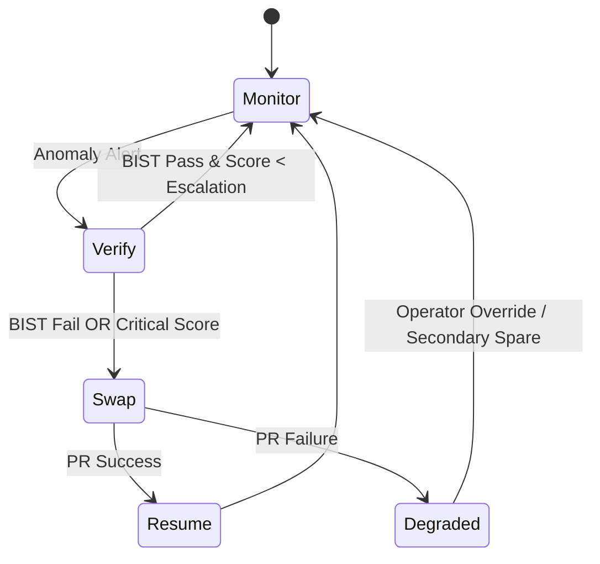

# SRA Technical Architecture

## 1. High-Level Flow
```mermaid
flowchart LR
  subgraph Guardians
    G1[Guardian A] -->|metrics| SHM
    G2[Guardian B] -->|metrics| SHM
    GN[Guardian N] -->|metrics| SHM
  end
  SHM[System Health Manager]\n(Policy + PR Control) -->|PR Command| PRC[Partial Reconfig Controller]
  PRC -->|Bitstream Req| STORE[Bitstream Repo]
  STORE --> PRC
  PRC --> RP_ACTIVE[Active Reconfig Partition]
  PRC --> RP_SPARE[Spare Partition]
  SHM --> LOG[(Event Log)]
```

## 2. Guardian Module (Conceptual)
Responsibilities:
- Acquire raw telemetry (temp, voltage, timing error counters, soft error scrubbing counts).
- Perform light feature extraction (delta, slope, normalized score, rolling mean, EWMA).
- Run TinyML inference (autoencoder reconstruction error or anomaly scoring model).
- Threshold + hysteresis + debounce logic.
- Raise alert with: {block_id, anomaly_score, feature_snapshot, timestamp}.

Constraints:
- LUT Budget Target: < 5k per Guardian.
- BRAM: < 2 blocks (model weights + feature window).
- Inference Period: 5–50 ms (configurable) to reduce power.

## 3. System Health Manager (SHM)
Runs in firmware on soft-core or external MCU.

State Machine (simplified):


Duties:
- Aggregate telemetry.
- Maintain moving baseline models (optional adaptive thresholding).
- Trigger BIST sequences.
- Command Partial Reconfiguration.
- Maintain audit/event log.
- Enforce spare allocation policy (e.g., least used, age-based, thermal-aware).

## 4. Partial Reconfiguration Strategy
- Each functional region = Reconfigurable Partition (RP) with identical interface.
- Static region forms backbone interconnect + SHM + PR Controller IP.
- Spare RPs remain blank or host low-priority functions until swap.
- Bitstreams: Signed + hashed; metadata table: {id, version, checksum, footprint, timestamp}.
- Swap Steps:
  1. Quiesce traffic (assert hold, flush FIFOs).
  2. Snapshot state (if required) to BRAM/AXI mem.
  3. Issue PR load (ICAP/PCAP bus or Intel PR IP).
  4. Integrity verify (hash compare in firmware).
  5. Re-bind routing (static crossbar / address map update).
  6. Release hold & restore state.

## 5. Data Model (Firmware)
```text
GuardianAlert {
  uint16_t block_id;
  uint16_t anomaly_score; // scaled 0..1000
  uint16_t bist_result;   // 0=unknown,1=pass,2=fail
  uint32_t feature_crc;   // checksum of feature vector
  uint64_t timestamp_us;
}
```

EventLog Entry Types:
- ALERT_RAISED
- BIST_TRIGGERED
- BIST_RESULT
- PR_INIT
- PR_SUCCESS / PR_FAIL
- SWAP_COMPLETE

## 6. ML Model Notes
Recommended: 1D Autoencoder (features dimension ~16). Parameters < 5k.
Pipeline:
- Normalize features offline -> store fixed-point scale factors.
- Inference uses int8 quantized weights.
- Reconstruction error compared to adaptive threshold (mean + k*sigma).

## 7. BIST Approach
- Pattern Set: Walking 1/0, LFSR pseudo-random short burst, signature compare.
- Completion Target: < 1 ms.
- Runs inside isolated RP before swap decision (if time permits) or on spare after load for validation.

## 8. Security Considerations
- Bitstream authentication (HMAC or ECDSA signature).
- Secure boot chain for SHM firmware.
- Disable unauthorized PR commands (ACL on control registers).
- Tamper flags escalate to safe mode (no swap unless verified).

## 9. Performance Targets (Initial)
| Metric | Target |
|--------|--------|
| Anomaly Detection Latency | < 10 ms from metric sample |
| Swap Latency (PR load) | < 10 ms typical (size-dependent) |
| False Positive Rate | < 1 per 72 hours per block (tunable) |
| Resource Overhead | < 12% LUT total for all Guardians |
| Power Overhead | < 5% compared to baseline design |

## 10. Open Questions / Future Work
- Adaptive model retraining in-field? (Edge incremental learning)
- Thermal-aware spare selection heuristics.
- Multi-fault cascading handling & prioritization.
- Integration with radiation-hard error scrubbing strategies.

---
Extend and refine as implementation matures.
